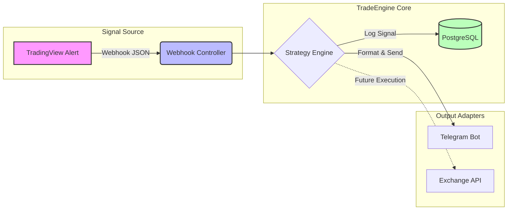

# TradeEngine - Automated Crypto Trading Bot based on Advanced Price Action

**TradeEngine** is an advanced backend system for automated trading, built on **Price Action** analysis and **Smart Money Concepts (SMC)**. The application identifies key market structures (Fair Value Gaps, Liquidity Zones) and combines them with momentum confirmations (Divergences) to generate **High Probability Setups**.

Currently operating as a real-time **Signal Provider** (via Telegram integration), the architecture is designed to support full **Order Execution** in future iterations.

---
## 🏗 System Architecture

The following diagram illustrates the data flow from the signal source to the notification engine.

## 🚀 Key Features

*   **DDD Architecture (Domain-Driven Design):** Clear separation of concerns ensuring scalable business logic.
*   **Event-Driven Approach:** Every market signal is treated as a distinct event for auditability.
*   **Real-time Processing:** Asynchronous webhook handling via Cloudflare Tunnel for minimal latency.
*   **Secure Ingress:** Zero Trust network configuration preventing public IP exposure.

## 🧠 Implemented Strategy Logic

The system operates on a **Dynamic Multi-Timeframe (MTF) Correlation Engine**. It continuously monitors market data across five intervals (M5, M15, H1, H4, D1) to identify high-probability setups based on the **Context + Trigger** model:

*   **HTF Context Identification:** The engine first locates structural elements on higher timeframes (e.g., **H4 Fair Value Gap** or **D1 Bias**).
*   **LTF Precision Entry:** Once price reaches the HTF zone, the system listens for specific confirmation patterns on lower timeframes (e.g., **M15 RSI Divergence**) to trigger the alert.

*Example workflow: H4 Bearish FVG detected -> Wait for Price Revisit -> M15 Bearish Divergence confirmed -> 🚨 Alert Sent.*

### 🧩 Signal Generation (Pine Script)

Unlike generic signal parsers, this system is tightly integrated with custom trading algorithms written in **Pine Script v5**.

## 📸 Live Signal Example

*Screenshot of a live alert delivered via Telegram during a recent BTC retracement:*

## 🛠️ Tech Stack & Infrastructure

### Core Backend
*   **Language:** Java 21 (LTS) - utilizing Records and Pattern Matching.
*   **Framework:** Spring Boot 3.5.7 (Web, Data JPA).
*   **Database:** PostgreSQL.
*   **Tools:** Lombok, Maven.

### Connectivity & Security
*   **Ingress:** **Cloudflare Tunnel (Zero Trust)** - secures webhook endpoints.
*   **Signal Source:** TradingView Webhooks (JSON payloads).
*   **Notification:** Telegram Bot API.

### Environment
*   **Current Deployment:** Self-hosted (On-premise) development environment.
*   **OS:** macOS / Windows (Multi-environment dev).

## 🚧 Roadmap & Future Improvements

The project is currently in **Active Development (Alpha Stage)**.

### Q1 2026 Priorities:
- [ ] **DevOps Transformation:** Containerization (Docker) and CI/CD pipelines (GitHub Actions).
- [ ] **Automated Execution:** Integration with Exchange APIs (Binance/Bybit) for auto-trading.
- [ ] **Backtesting Module:** Simulation of strategies on historical data.
