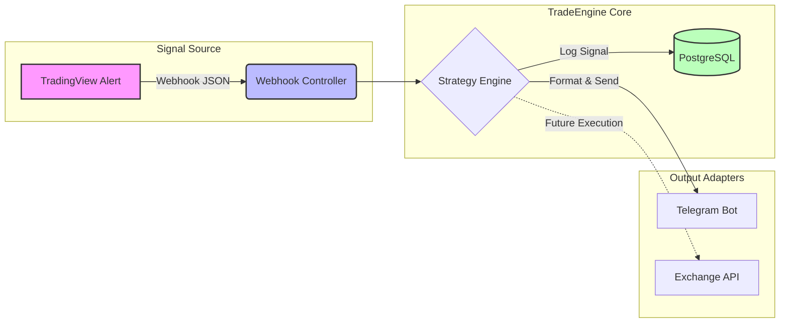
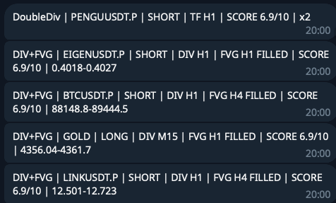

# TradeEngine - Automated Crypto Trading Bot based on Price Action

**TradeEngine** is an advanced backend system for automated trading, built on **Price Action** analysis and **Smart Money Concepts (SMC)**. The application identifies key market structures (Fair Value Gaps, Liquidity Zones) and combines them with momentum confirmations (Divergences) to generate **High Probability Setups**.

Currently operating as a real-time **Signal Provider** (via Telegram integration), the architecture is designed to support full **Order Execution** in future iterations.

---
## 🏗 System Architecture

The following diagram illustrates the data flow from the signal source to the notification engine.

## 🚀 Key Features

*   **DDD Architecture (Domain-Driven Design):** Clear separation of concerns ensuring scalable business logic.
*   **Event-Driven Approach:** Every market signal is treated as a distinct event for auditability.
*   **Real-time Processing:** Asynchronous webhook handling via Cloudflare Tunnel for minimal latency.
*   **Secure Ingress:** Zero Trust network configuration preventing public IP exposure.

## 🧠 Strategy Logic & Algorithms

The system operates on a **Dynamic Multi-Timeframe (MTF) Correlation Engine**. It currently implements two core strategies based on the **Context + Trigger** model:

### 1. The "Multi-Divergence" Strategy
A pure momentum strategy that seeks exhaustion in trend on higher timeframes.
*   **Logic:** Continuously scans for **multiple divergences** (at least double) on key intervals (**H1, H4, D1**).
*   **Trigger:** Alerts are generated only when a divergence stack (e.g., Triple Bearish Divergence) is confirmed.
*   **Alert Metadata:** The system classifies signal strength by divergence count (e.g., `x2`, `x3` strength) to prioritize stronger reversal signals.

### 2. FVG + Divergence Confluence
A "Return to Value" strategy based on **Smart Money Concepts (SMC)**.
*   **HTF Context:** Identifies structural imbalance (**Fair Value Gap**) on **H1/H4/D1**.
*   **LTF Precision Entry:** Waits for price to mitigate the FVG zone. Once inside, the system listens for a confirmation trigger (e.g., **M15 RSI Divergence**) before alerting.

*Example workflow: H4 Bearish FVG detected -> Wait for Price Revisit -> M15 Bearish Divergence confirmed -> 🚨 Alert Sent.*

### 🧩 Signal Generation

The system functionality relies on **proprietary algorithms** developed in **Pine Script v5** (hosted on TradingView). Unlike generic parsers, the backend is tuned to process specific, pre-validated payloads containing rich metadata (e.g., divergence strength, FVG coordinates) rather than simple trigger alerts.

## 📸 Live Signal Example

*Screenshot of a live alert delivered via Telegram during a recent BTC retracement:*

## 🛠️ Tech Stack & Infrastructure

### Core Backend
*   **Language:** Java 21 (LTS) - utilizing Records and Pattern Matching.
*   **Framework:** Spring Boot 3.5 (Web, Data JPA).
*   **Database:** PostgreSQL.
*   **Tools:** Lombok, Maven.

### Connectivity & Security
*   **Ingress:** **Cloudflare Tunnel (Zero Trust)** - secures webhook endpoints.
*   **Signal Source:** TradingView Webhooks (JSON payloads).
*   **Notification:** Telegram Bot API.

### Environment
*   **Current Deployment:** Self-hosted (On-premise) development environment.
*   **OS:** macOS / Windows (Multi-environment dev).

## 🚧 Roadmap & Future Improvements

The project is continuously evolving from a signal provider into a full-stack trading platform.

### 🔹 Core Execution & Risk Management
- [ ] **Exchange Integration:** Connector implementation for **Bybit** and **Hyperliquid** APIs.
- [ ] **Smart Risk Engine:** Automated position sizing based on Account Equity % and dynamic Stop Loss levels.
- [ ] **Trade Management:** Logic for Breakeven triggers, Trailing Stops, and Partial Take Profits.

### 🔹 Strategies & Backtesting
- [ ] **Backtesting Engine:** Simulation module to validate strategies against historical data before deployment.
- [ ] **Strategy Versioning:** Mechanism to manage multiple versions of strategy logic (e.g., `v1.0` vs `v1.2`) simultaneously.
- [ ] **Dynamic Parameterization:** Ability to adjust strategy thresholds (e.g., RSI periods, FVG depth) without redeploying code.

### 🔹 UI & Analytics (Web Dashboard)
- [ ] **Admin Dashboard:** A graphical interface to toggle active strategies and manage configuration.
- [ ] **Performance Analytics:** Visualization of Win Rate, Profit Factor, and Drawdown curves.
- [ ] **Signal History:** Searchable table of all past alerts and their outcomes.

### 🔹 DevOps & Infrastructure
- [ ] **Dockerization:** Full containerization of the Spring Boot app and PostgreSQL database.
- [ ] **CI/CD Pipeline:** GitHub Actions workflows for automated testing and building.
